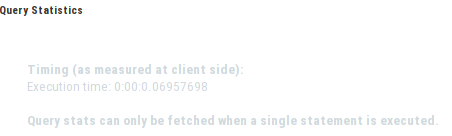
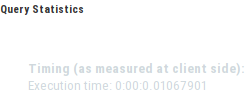
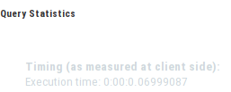
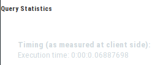
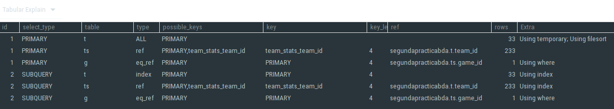
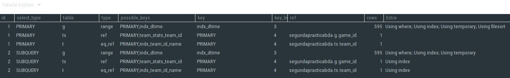
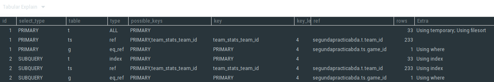
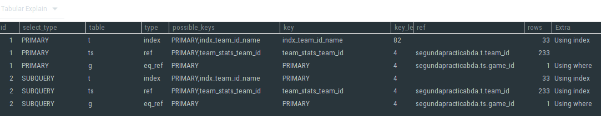
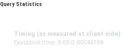

---
title: "Memoria diseño modelo relacional"
author: [Luis Mata bm0613, Javier Morate bm0620]
date: "05-04-2019"
subtitle: "Segunda Práctica de Bases de Datos Avanzadas - UPM"
logo: logo.png
titlepage: "True"
toc: "True"
toc-own-page: "True"
listings-no-page-break: "True"
...

# Memoria de trabajo sobre técnicas de aceleración de consultas


## 1. Introducción y forma de trabajo

Para esta práctica hemos usado como equipo un portátil DELL XPS 15 9550 con las siguientes especificaciones:

- CPU: Intel i7-6700HQ (8) @ 3.500GHz 
- Memory: 15882MiB 
- OS: openSUSE Leap 15.0 x86_64
- Kernel: 4.12.14-lp150.12.48-default

Para realizar la práctica, además hemos usado git como sistema de control de versiones, utilizando como servicio Github en el siguiente enlace se encuntra el repositorio utilizado:

- [Enlace al repositorio de Github](https://github.com/lmataa/bda_practica2)

Como sistema de gestión de base de datos hemos usado MariaDB salvando las explicaciones de plan de consulta que las hemos realizado en los laboratorios de la escuela.

## 2. Puntos pedidos

### 1. Se realizará la importación del esquema y datos de las cuatro tablas

> Mediante la opción “Data Import” del menú Server de MySqlWorkbench con el fichero “dumpBDAprac2.sql” disponible en el Moodle de la asignatura.

Realizamos la importación del esquema sin mayor complicaciones, nombramos a la base de datos utilizada *"segundapracticabda"*.

### 2. Estudio de paneles de consulta e índices.

#### a. Crear una consulta SQL que permita obtener el número de partidos jugados por cada jugador para aquellos jugadores de nacionalidad estadounidense (USA) o canadiense (CAN) que hayan jugado más partidos que la media del número de partidos jugados por todos los jugadores. La consulta devolverá el nombre y apellido del jugador y su edad actual, así como el número de partidos jugados, pero el resultado estará ordenado descendentemente por edad e a igual edad por apellido seguido de nombre pero ascendentemente.


```SQL
USE segundapracticabda;
SET GLOBAL query_cache_type = 0;
SELECT firstName, lastName, edad, COUNT(*) AS partidosJugados
FROM player p INNER JOIN player_stats ps ON p.player_id = ps.player_id
WHERE nationality='CAN' OR nationality='USA'
GROUP BY firstName, lastName, edad
HAVING partidosJugados >= ALL(select avg(partidosJugados)
	FROM (SELECT player_id, COUNT(*) as partidosJugados
		FROM player_stats
		GROUP BY by player_id) as td)
ORDER BY edad DESC, lastName ASC, firstName ASC
```

#### b. Estudiar el plan de consulta, tomando nota de los costes del mismo y comentarlo.


    

    

#### c. Crear las claves principales y foráneas mediante los ficheros script CrearClavesPrimarias.sql y CrearClavesForeaneas.sql, y nuevamente estudiar el pland e consulta, comparando costes con el punto anterior.


    

   

#### d. Crear los índices que se estimen necesarios para mejorar la consulta.

Creamos un índice para nacionalidad, ya que ésta se situa en la cláusula WHERE, por lo que la consulta es susceptible de mejorar con un índice, además se trata de una cadena de 3 caracteres por lo que no resultaría costoso.

El otro índice que creamos va para la triada firstName, lastName y edad situada en la cláusula GROUP BY, por lo que también es susceptible de mejora.

```SQL
CREATE INDEX indx_nation
ON player(nationality);

CREATE INDEX indx_name_age
ON player(firstName, lastName, edad);
```

#### e. Estudiar el plan de consulta con los nuevos índices y comparar resultados con los obtenidos en los puntos anteriores.


    

    

### 3. Optimización de consultas y estudio de planes de consulta

#### a. Eliminar los índices creados en el apartado anterior, manteniendo claves primarias y foráneas.

```SQL
DROP INDEX indx_nation
ON player;

DROP INDEX indx_name_age
ON player;
```

#### b. Definir en SQL al menos dos sentencias diferentes que permitan obtener los datos de los equipos que hayan jugado más partidos en los últimos seis meses del año 2017, devolviendo los atributos: identificador del equipo, nombre del equipo, número de partidos jugados, total de tiros (tshots) realizados en esos seis meses, media de goles del equipo por partido.

La primera consulta que realizamos utiliza los valores de fechas absolutos y la segunda utiliza valores de fecha aplicando la función YEAR y MONTH.

```SQL
-- Primera consulta
USE segundapracticabda;
SET GLOBAL query_cache_type = 0;
SELECT t.team_id, teamName, SUM(tshots) AS tiros, AVG(tgoals) AS avg_gol_partido, count(*) AS numPartidos
FROM team t INNER JOIN team_stats ts ON t.team_id=ts.team_id 
INNER JOIN game g ON ts.game_id = g.game_id
WHERE date_time BETWEEN '2017-07-1' AND '2017-12-31'
GROUP BY t.team_id, teamName
HAVING numPartidos >= ALL(SELECT count(*) AS numPartidos
	FROM team t INNER JOIN team_stats ts ON t.team_id=ts.team_id 
    		    INNER JOIN game g ON ts.game_id=g.game_id
	WHERE date_time BETWEEN '2017-07-1' AND '2017-12-31'
	GROUP BY t.team_id);
```
```SQL
-- Segunda consulta
USE segundapracticabda;
SET GLOBAL query_cache_type = 0;
SELECT t.team_id,teamName,SUM(tshots) AS tiros, AVG(tgoals) AS gol_partido, count(*) AS numPartidos
FROM team t INNER JOIN team_stats ts ON t.team_id=ts.team_id
INNER JOIN game g ON ts.game_id=g.game_id
WHERE YEAR(date_time)=2017 AND MONTH(date_time)>=7
GROUP BY t.team_id, teamName
HAVING numPartidos >= ALL(SELECT count(*) AS numPartidos
	FROM team t INNER JOIN team_stats ts ON t.team_id=ts.team_id
    		    INNER JOIN game g ON ts.game_id=g.game_id
	WHERE YEAR(date_time)=2017 AND MONTH(date_time)>=7
	GROUP BY t.team_id);
```

#### c. Crear los índices que permitan optimizar el coste de las consultas, analizando plan de consulta y coste para cada uno de los casos, justificando que solución es la más óptima.

En la primera consulta realizada en este apartado no usamos funciones para la fecha y se encuentra en la cláusula WHERE, por lo tanto es susceptible de mejora con índice.

En ambas consultas realizamos un GROUP BY por team_id y teamName, por lo que un índice para ambos valores es considerado en ambas para optimizar. 

```SQL
-- Creación de índices para la primera consulta
CREATE INDEX indx_dtime
ON game(date_time);
CREATE INDEX indx_team_id_name
ON team(team_id, teamName);
```
```SQL
-- Creación de índices para la segunda consulta
CREATE INDEX indx_team_id_name
ON team(team_id, teamName);
```

- Los resultados obtenidos en este apartado para las consultas realizadas indican una mejora sustancial en cuanto al uso de índices. Veamos:


    

    

    

    
- En cuanto a los planes de ejecución:


    

    

    

    

### 4. Estudio de índices en actualizaciones.

#### a. Eliminar los índices creados en el apartado anterior manteniendo claves primarias y foráneas.

```SQL
DROP INDEX indx_dtime
ON game;

DROP INDEX indx_team_id_name
ON team;
```

#### b. Crear un atributo en la tabla "player_stats" que se denomine "puntuación"que sea un número entero. El contenido de dicho atributo, para cada estadística de cada partido será un valor que se corresponderá con la suma de las cantidades de los atributos goals, shots y assists (es decir, en cada fila se sumarán los valores de estos atributos y se actualizará en el nuevo atributo "puntuación" con esa suma.) Actualizar la tabla player_stats para que contenga dicha información tomando nota de su tiempo de ejecución.

```SQL
USE segundapracticabda;
SET GLOBAL query_cache_type = 0;

ALTER TABLE player_stats
ADD COLUMN puntuacion INT;

UPDATE player_stats
SET puntuacion = (select SUM(assists+goals+shots));
```


#### c. Volver a actualizar a null el atributo puntuación en todas las filas.

```SQL
USE segundapracticabda;
SET GLOBAL query_cache_type = 0;
UPDATE player_stats
SET puntuacion = null;
```

#### d. Por preverse un tipo de consultas con ordenación muy complicada, se desea crear un índice en la tabla "player_stats" por los atributos goals, shots, game_id, assists, player_id y puntuación, en ese orden. Crear el índice.

```SQL
CREATE INDEX indx_stats
ON player_stats(goals, shots, game_id, assists, player_id, puntuacion);
```

#### e. Volver a ejecutar la sentencia que establece los valores del atributo puntuación a la suma comentada anteriormente. Comprobar tiempo de ejecución y compararlo razonadamente con el contenido del punto 4.b.



### 5. Desnormalización

#### a. Eliminar los índices creados en el apartado anterior, manteniendo claves primarias y foráneas.

```SQL
DROP INDEX indx_stats
ON player_stats;
```

#### b. Crear una consulta que devuelva, para cada jugador su nombre, apellido, edad, total de asistencias (assists) y media de asistencias por partido, total de goles (goals) y media por partido para aquellos jugadores que tengan una edad entre 25 y 33 años.

```SQL
USE segundapracticabda;
SET GLOBAL query_cache_type = 0;
SELECT firstName, lastName, edad, goles, media_goles, SUM(assists) AS asistencias, AVG(assists) AS media_asis
FROM player p INNER JOIN player_stats ps ON p.player_id = ps.player_id
WHERE edad BETWEEN '25' AND '33'
GROUP BY firstName, lastName, edad, goles, media_goles;
```

#### c. Aplicar la técnica de desnormalización que se considere más adecuada para acelerar la consulta del apartado 5.b, creando los scripts sql necesarios para modificar el esquema de la base de datos.

Para mejorar el coste de la consulta anterior vamos a aplicar la ténica de desnormalización en la tabla de jugadores. Para ello vamos a añadir a esta tabla las columnas de estadísticas de jugador correspondientes a asistencias, ya que goles y media_goles ya pertenecen a la tabla de jugador. Si no hubiesen pertenecido goles y media_goles a esta tabla, entonces hubiésemos aplicado desnormalización también con esas columnas.

Como alternativa también podríamos haber incluido la media de asistencias en la tabla de jugadores pero resultaría costoso para actualizaciones, por lo que dejamos que la carga de trabajo de esta desnormalización recaiga en la consulta y no en las actualizaciones.

```SQL
USE segundapracticabda;
SET GLOBAL query_cache_type = 0;

ALTER TABLE player
ADD COLUMN asistencias INT;
```

#### d. Crear un script que actualice los datos implicados en la desnormalización.
```SQL
USE segundapracticabda;
SET GLOBAL query_cache_type = 0;
UPDATE player
SET asistencias = (SELECT assists FROM player_stats);
```

#### e. Crear los triggers necesarios para mantener actualizados los datos implicados en la desnormalización.

```SQL

```

#### f. Realizar la consulta 5.b sobre la base de datos desnormalizada. Estudiar coste y plan comparándolo con el obtenido en el apartado 5b.


    

    
### 6. Particionamiento.

#### a. Eliminar las claves foráneas con el script proporcionado “EliminarClavesForaneas.sql”.

En este apartado ejecutamos el script pertinente, sin más comentarios.

#### b. Crear una consulta sql que obtenga, para cada jugador, su apellido, nombre, el número de partidos jugados y el número de jugadas realizadas por el jugador durante el año 2017. Estudiar coste y plan.

```SQL

```

#### c. Razonar justificadamente (sin necesidad de implementarla realmente en SQL) una variante de la estructura existente realizando un particionamiento horizontal de los datos con el objeto de mejorar el tipo de consultas (con diferentes años) que se ha realizado en el apartado 6.a

Como hemos visto en las clases de laboratorio de la asignatura, un particionamiento horizontal puede ser muy útil si solo se van a acceder a datos en un determinado rango. Puede suponer pasar de hacer consultas de varios millones de filas a consultas de medio millón o incluso resultar útil para ciertas proyecciones.

Por lo siguiente, nuestra propuesta consiste en hacer un particionamiento horizontal por años donde tendríamos tantas tablas como años para nuestro esquema. Esto supondría una mejora sustancial ya que, especialmente en un sistema de gestión de base de datos de un club deportivo, interesaría especialmente hacer consultas frecuentes (o inserciones y actualizaciones) en la temporada actual.

#### d. Implementar en MySQL un particionamiento horizontal (mediante la sentencia ALTER TABLE …. PARTITION ….) que separe los datos de los partidos jugados en el año 2017 del resto. Realizar de nuevo la consulta 6.a y estudiar coste y plan comparándolo con lo obtenido en el apartado 6.a. Si se necesita modificar la clave primaria, hágase mediante la sentencia ALTER TABLE.

Sigue la lógica anteriormente comentada, en este caso vamos a tener una tabla con los datos correspondientes a un solo año y por otro lado una tabla con el resto de años.

Resulta que no podemos realizar particionamientos con MySQL en tablas que tengan claves foráneas, por lo que hay que ejecutar el script del punto 6.a (requisito ya cumplido) además tampoco podemos usar claves primarias. Eliminar esta clave sería una mala solución por lo que utilizamos una superclave conformada por game_id y date_time. De forma que podamos acceder a todas las tablas particionadas con clave.

```SQL
-- Particionamiento horizontal
ALTER TABLE game DROP PRIMARY KEY;

ALTER TABLE game ADD PRIMARY KEY(game_id, date_time);

ALTER TABLE game 
PARTITION BY LIST (YEAR(date_time)) (
	PARTITION part_2017 VALUES IN (2017),
    PARTITION part_resto VALUES IN (2013, 2014, 2015, 2016, 2018)
);
```

Realizamos ahora de nuevo la consulta 6.b, especificando su partición, y observamos las diferencias.
```SQL
-- Consulta en partición

```


## 3. Conclusiones

La realización de la práctica nos ha puesto al día con lo explicado en la parte teórica de la asignatura correspondiente a índices y optimización de consultas en bases de datos relacionales. 

Ha sido especialmente interesante el disponer de métricas de coste para las consultas, como prueba empírica de que se están realizando optimizaciones reales.

Aunque no hayamos usado los planes de consulta gráficos de MySQL, también hemos acabado enfrentándonos a la interpretación tabular de los planes de consulta de MariaDB. Sin embargo y por el bien de nuestra mejor comprensión, también hemos ejecutado los scripts en los equipos de la escuela y hemos obtenido el plan de consultas de ahí para un análisis más gráfico que hemos reflejado en esta memoria.


